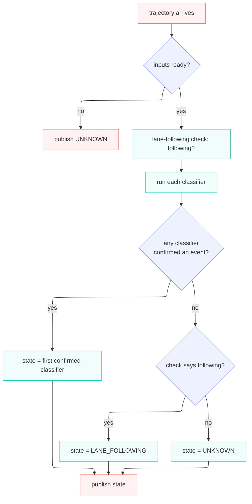

# lane_event_classifier

Classifies lane events, lane change, intentional lane crossing, for event logging.

---

## What this node does

Every cycle, the node publishes **one** state describing what the ego is doing with respect to its
lane.

The state is published on `/planning/driving_factor` as a `DrivingState`. A downstream event recorder
stores every frame, so the log can later show when the vehicle changed lanes, aborted, or drifted,
and for how long.

!!! note

    The node doesn't do anything else except publishing driving states. No MRM and no control involved.

---

## Key words

These terms are shared across the classifiers. Each classifier's own doc links here on first use and
defines only the terms specific to it.

| Term            | Meaning                                                                                                                                                                                      |
| --------------- | -------------------------------------------------------------------------------------------------------------------------------------------------------------------------------------------- |
| Reference lane  | The lane the tracker is holding for the ego this cycle. Locked while an event runs, released and re-anchored to the ego's current lane when the event ends.                                  |
| Route primitive | A preferred lane of the current route, one of the planned-path lanes the ego drives on a best-effort basis. So "is this lane a route primitive?" asks whether the lane is part of that path. |

---

## Inputs and output

**Trigger.** The node runs once per planned trajectory message. `/planning/trajectory` is the clock.

### Subscriptions

| Topic                      | Type                   | Role                                                                                                          |
| -------------------------- | ---------------------- | ------------------------------------------------------------------------------------------------------------- |
| `/planning/trajectory`     | `Trajectory`           | Per-cycle trigger; also the predictive signal for lane change.                                                |
| `/map/vector_map`          | `LaneletMapBin`        | The lanelet map (latched, taken once).                                                                        |
| _(polled)_ odometry        | `Odometry`             | Ego pose; its stamp drives all timers (determinism).                                                          |
| _(polled)_ route           | `LaneletRoute`         | The mission and its preferred primitives.                                                                     |
| _(polled)_ objects         | `PredictedObjects`     | Perceived objects (used by crossing logic).                                                                   |
| _(polled)_ turn indicators | `TurnIndicatorsReport` | Optional hint for the lane-change confidence booster. Never a precondition, if missing, the cycle still runs. |

### Publication

| Topic                      | Type                                         |
| -------------------------- | -------------------------------------------- |
| `/planning/driving_factor` | `DrivingFactor` (carries one `DrivingState`) |

### Output states (`DrivingState`)

| State                                | Value | Meaning                                                                             |
| ------------------------------------ | ----- | ----------------------------------------------------------------------------------- |
| `UNKNOWN`                            | 0     | Inputs not ready, **or** the ego left its lane but no classifier claimed the event. |
| `LANE_FOLLOWING`                     | 1     | The ego is still in its lane and no event is active.                                |
| `LANE_CHANGING`                      | 2     | The lane-change classifier confirmed a change in progress.                          |
| `ABORTING_LANE_CHANGE`               | 3     | A committed lane change is reversing back to the reference lane.                    |
| `INTENTIONAL_LANE_CROSSING`          | 4     | The intentional-crossing classifier confirmed a crossing.                           |
| `ABORTING_INTENTIONAL_LANE_CROSSING` | 5     | A committed intentional crossing is reversing.                                      |

---

## How the node decides the state (per cycle)

> **The lane-following check.** `LaneFollowingChecker` answers one yes/no question: _is the ego
> still inside the lane it is supposed to be following?_ Its result is
> the **default label**: when no classifier claims an event, the check passing gives `LANE_FOLLOWING`,
> and the check failing (the ego left its lane, unexplained) gives `UNKNOWN`. It runs alongside the
> classifiers, not before them, they run every cycle regardless. Full rule chain:
> [`docs/lane_following.md`](docs/lane_following.md).

The order of resolution:

1. **Every enabled classifier runs every cycle.** A classifier reporting `LANE_FOLLOWING` or
   `UNKNOWN` counts as "no event".
2. **First confirmed classifier wins.** Classifiers are checked in a fixed priority order
   (lane change, then intentional crossing).
3. **No event → fall back to the lane-following check.** If the check says following, the state is
   `LANE_FOLLOWING`. If the check says the ego departed but no classifier explained it, the state is
   `UNKNOWN`.

---

## Architecture (who owns what)

The classifiers are **not** loaded via pluginlib. The node owns a `std::vector` of concrete
`LaneEventClassifierBase` implementations, built once in `build_classifiers()` and iterated each
cycle. Adding a classifier is: implement the interface, then register it in `build_classifiers()`.

| Component                       | Responsibility                                                                                                         |
| ------------------------------- | ---------------------------------------------------------------------------------------------------------------------- |
| `LaneEventClassifierNode`       | Owns the subscriptions/publisher, runs the per-cycle sequence above, and arbitrates the winning state.                 |
| `LaneEventClassifierBase`       | The classifier interface: `update()`, `get_state()`, `is_enabled()`, `name()` (+ optional `debug_reason()` / markers). |
| `LaneFollowingChecker`          | The lane-following check. Node-owned, separate from the classifiers.                                                   |
| `LaneChangeClassifier`          | The lane-change recogniser (a `LaneEventClassifierBase`).                                                              |
| `IntentionalCrossingClassifier` | The intentional-crossing recogniser (a `LaneEventClassifierBase`).                                                     |

---

## What's implemented now

| Piece                              | Status                                                                 |
| ---------------------------------- | ---------------------------------------------------------------------- |
| Node I/O (subscriptions/publisher) | ✅ implemented                                                         |
| Classifier loading + aggregation   | ✅ implemented                                                         |
| `LaneFollowingChecker`             | ✅ implemented, see [`docs/lane_following.md`](docs/lane_following.md) |
| `LaneChangeClassifier`             | ✅ implemented, see [docs/lane_change.md](docs/lane_change.md)         |
| `IntentionalCrossingClassifier`    | ✅ implemented, see [docs/lane_crossing.md](docs/lane_crossing.md)     |
| `LaneTracker` (map/reference lane) | ✅ implemented, owns the map, routing graph, and reference lane        |

---

## Parameters

Schema: [`schema/lane_event_classifier.schema.yaml`](schema/lane_event_classifier.schema.yaml).
Defaults: [`param/lane_event_classifier.param.yaml`](param/lane_event_classifier.param.yaml).

| Name                              | Meaning                                                                                                                                                                                                                                                                                                                      |
| --------------------------------- | ---------------------------------------------------------------------------------------------------------------------------------------------------------------------------------------------------------------------------------------------------------------------------------------------------------------------------- |
| `reposition_jump_margin_m`        | Localization-noise margin added to the speed-explained step (`speed · dt`, taking the faster of this cycle's and the previous cycle's speed so braking does not shrink the budget); a per-cycle ego step beyond that is treated as a reposition jump and resets the tracking state.                                          |
| `lane_departure_reset_distance_m` | While the reference lane is held, distance from the ego to that lane above which the tracking state is reset (countermeasure for a manual takeover).                                                                                                                                                                         |
| `stuck_reanchor_reset_duration_s` | While the reference lane is not held, seconds the ego must stay both unreachable-forward from it and beyond `lane_departure_reset_distance_m` before the tracking state is reset (the tracker only re-anchors on forward progress, so an unheld reference lane the ego never returns to would otherwise stay stuck forever). |

Lane-following check parameters (`lane_following.*`) are documented in [`docs/lane_following.md`](docs/lane_following.md#parameters).

Lane-change classifier parameters (`lane_change.*`) are documented in [`docs/lane_change.md`](docs/lane_change.md#parameters).

Intentional-crossing classifier parameters (`lane_crossing.*`) are documented in [`docs/lane_crossing.md`](docs/lane_crossing.md#parameters).

---
