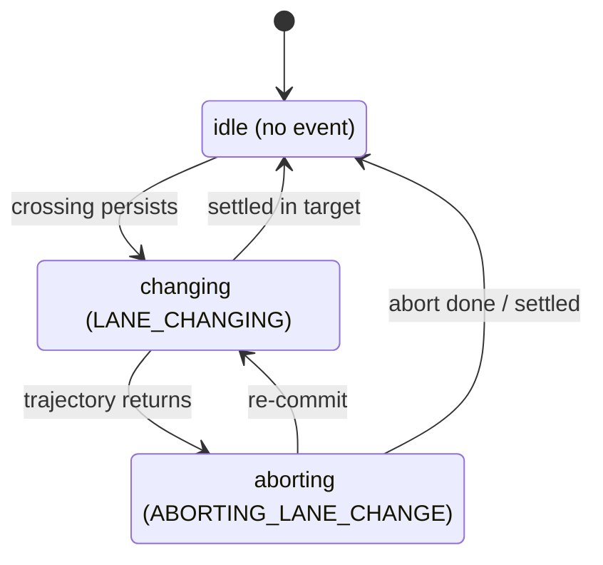

# The lane-change classifier

## What this does

`LaneChangeClassifier` answers one question each cycle: **is the ego moving into another lane, and
where in that move is it**, starting, aborting, or done? It reports `LANE_CHANGING` while a change
is in progress and `ABORTING_LANE_CHANGE` while a committed change reverses. Completion is not a
state of its own: a finished change is the edge back to no event.

Detection is predictive. The classifier does not wait for the body to cross the lane line; it reads
the planned trajectory and can confirm a change while the ego is still inside its lane. The planner
is generative and publishes no intent, so the trajectory shape is the earliest signal available.

When the classifier is idle it reports no event, and the node labels the cycle from its
[lane-following check](lane_following.md): `LANE_FOLLOWING` while the ego is still in its lane,
`UNKNOWN` if it has departed with nothing to explain the departure.

## Key words

[Reference lane](../README.md#key-words) and [route primitive](../README.md#key-words) are shared
across the package. The terms below are specific to lane change.

| Term                   | Meaning                                                                                                                                                                                                                                                            |
| ---------------------- | ------------------------------------------------------------------------------------------------------------------------------------------------------------------------------------------------------------------------------------------------------------------ |
| Straight lane sequence | The reference lane plus every lane reachable straight (fore and aft) within `crossing_look_ahead_m`. Staying in this set is going straight. The [lane-following check](lane_following.md) builds the same set with a longer reach (`connected_sequence_length_m`). |
| Crossing               | The first point where the planned trajectory leaves the straight lane sequence sideways into another lane.                                                                                                                                                         |
| Settle                 | The footprint fully inside a route primitive other than the reference lane. This is how a change completes.                                                                                                                                                        |
| Ego footprint          | The vehicle body polygon. Onset uses the trajectory (a prediction); settle and abort completion use the footprint (the real body).                                                                                                                                 |

## How the classifier decides

The classifier is a state machine with three phases. Each phase maps to one reported result.

Each edge label is the short trigger; the exact conditions are in the sections below. When a phase
returns to idle, the reference lane is released and re-anchored to the lane the ego is now in, so the
lane just entered becomes the next reference lane.

## Onset

Onset has two parts: find a valid [crossing](#key-words), then require it to persist.

### Finding a crossing

The classifier walks the forward trajectory, the trajectory points from the one nearest the ego
forward until the arc length reaches `crossing_look_ahead_m`, and looks for the crossing in order:

1. **Straight-on-route skip.** If the reference lane is a route primitive whose straight successor
   is also a route primitive, going straight already stays on-route, so any sideways move leaves the
   route rather than changing lanes on it. No onset.
2. **Walk the trajectory.** For each forward point, take the lanes containing it. The first point
   that lands in a lane outside the [straight lane sequence](#key-words) marks the crossing: that lane is the
   target, and the point is the crossing point. The side comes from the sign of the lateral offset
   from the reference centerline.
3. **Necessity.** The crossing counts only when the trajectory reaches a route primitive sideways,
   possibly through non-primitive intermediate lanes. A drift into an off-route lane is not a lane
   change.

### Exemptions

A found crossing is dropped when any of these hold:

- The reference lane is a turn or intersection lane (turning is not a lane change).
- The target lane is a road shoulder.
- The crossed boundary is a virtual linestring, not a real lane marking.

These are the turn-lane and virtual-boundary exemptions the [lane-following check](lane_following.md)
already applies, reused here for onset.

### Persistence and confidence

A single-frame crossing is not trusted. The same crossing must persist across cycles: the same
target lane, and a crossing point stable within `crossing_position_tolerance_m`, sustained for
`crossing_persist_duration_s`. If the crossing jumps to a different lane or a far-apart point, the
timer restarts.

A confidence signal shortens the wait without skipping it. The signal is present when the whole
[footprint](#key-words) has already left the route-primitive lanes, or the turn blinker points toward the target
side. When present, the persistence window is multiplied by `confidence_factor`, so a boosted onset
confirms in `crossing_persist_duration_s * confidence_factor` instead of the full window.

When the crossing persists long enough, the phase becomes `LANE_CHANGING`.

## Finishing or aborting

While in `LANE_CHANGING`, two conditions are watched together.

**[Settle](#key-words) (completion).** The footprint fully inside a route primitive other than the reference lane
for `settle_confirm_duration_s` ends the change: the phase returns to idle and the target lane
becomes the reference lane. A later settle in yet another lane is a second, separate lane change, not
part of the first.

**Abort.** The trajectory heading back into the reference lane (no forward crossing, and the far
look-ahead point back inside the reference lane), persisted for `crossing_persist_duration_s`, moves
the phase to `ABORTING_LANE_CHANGE`.

## Aborting

While in `ABORTING_LANE_CHANGE`, three conditions are watched.

**Abort complete.** The footprint fully back inside the reference lane returns the phase to idle.
This is geometric, with no extra dwell.

**Settle still counts.** If instead the footprint reaches a route primitive for the settle window,
the change is treated as completed after all and the phase returns to idle. A give-up can still end
in the target lane.

**Re-commit.** If the trajectory swings back toward the target and a crossing persists again, the
phase returns directly to `LANE_CHANGING` without passing through idle.

There is no timed exit from aborting; it leaves only by one of these three edges. A localization jump
or the ego straying far from the held reference lane is handled separately, by the node's
tracking-state reset.

## Parameters

Schema: [`schema/lane_event_classifier.schema.yaml`](../schema/lane_event_classifier.schema.yaml).
Defaults: [`param/lane_event_classifier.param.yaml`](../param/lane_event_classifier.param.yaml).

| Name                            | Default | Meaning                                                                                          |
| ------------------------------- | ------- | ------------------------------------------------------------------------------------------------ |
| `enable_classifier`             | true    | Turn the lane-change classifier on or off.                                                       |
| `crossing_look_ahead_m`         | 30.0    | Arc length ahead along the trajectory scanned for a crossing.                                    |
| `crossing_persist_duration_s`   | 0.3     | Seconds a crossing (and an abort return) must persist before it is confirmed.                    |
| `crossing_position_tolerance_m` | 2.0     | How far the crossing point may move and still count as the same crossing.                        |
| `confidence_factor`             | 0.3     | Fraction the persistence window shrinks to when a confidence signal is present (0 < factor < 1). |
| `settle_confirm_duration_s`     | 0.7     | Seconds the footprint must stay fully inside the target route primitive to confirm a completion. |

## Design notes

- **Predictive onset.** Onset reads the planned trajectory, not the body, so a change confirms before
  the ego crosses the line. This is why onset uses the ego reference point via the trajectory while
  settle and abort completion use the full footprint: the trajectory predicts, the footprint confirms.
- **Deterministic timers.** Every persistence window is measured against the message stamp
  (`odometry.header.stamp`), never wall-clock, so replaying a bag reproduces the same states.
- **Reference lane frozen during an event.** The tracker re-anchors only on forward progress into a
  next lane, never on a sideways move, so a change is not mistaken for progress and the reference
  holds through the predictive onset window.
- **Separation of concerns.** `LaneTracker` is a generic map/geometry library that knows nothing
  about lane changes; `LaneChangeGeometry` turns its queries into the per-cycle observation; the
  classifier is a pure state machine over that observation.
