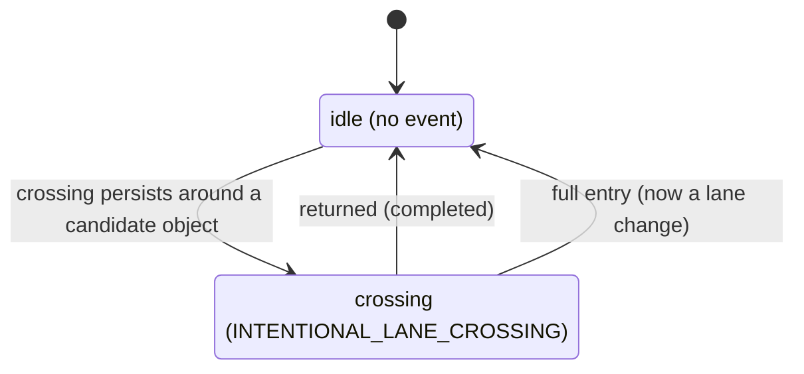

# The intentional-lane-crossing classifier

## What this does

`IntentionalCrossingClassifier` answers one question each cycle: **is the ego stepping sideways over
a lane boundary to get around something ahead, then coming back**? It reports
`INTENTIONAL_LANE_CROSSING` while that dodge is in progress. Completion is not a state of its own: a
finished crossing is the edge back to no event.

A crossing is a partial move. The ego leaves its lane far enough to pass an object, but the body
never fully enters the neighbour lane. The moment the whole footprint is inside the neighbour, the
move is a lane change, and this classifier hands off to the [lane-change classifier](lane_change.md).

Onset watches two things at once: the planned trajectory (a prediction, so the crossing can confirm
before the body reaches the line) and the current footprint (the real body, which catches a yawed
corner poking over a boundary the centerline never crosses). Either one, around a
[candidate object](#key-words), starts the crossing.

When the classifier is idle it reports no event, and the node labels the cycle from its
[lane-following check](lane_following.md): `LANE_FOLLOWING` while the ego is still in its lane,
`UNKNOWN` if it has departed with nothing to explain the departure.

## Key words

[Reference lane](../README.md#key-words) and [route primitive](../README.md#key-words) are shared
across the package. The terms below are specific to intentional crossing.

| Term                   | Meaning                                                                                                                                                                                                                                                             |
| ---------------------- | ------------------------------------------------------------------------------------------------------------------------------------------------------------------------------------------------------------------------------------------------------------------- |
| Straight lane sequence | The reference lane plus every lane reachable straight (fore and aft) within `crossing_look_ahead_m`. The dodge starts and ends inside this set. `LaneChangeGeometry` and the [lane-following check](lane_following.md) build the same set with other reach lengths. |
| Candidate object       | A perceived object that touches the straight lane sequence and sits ahead of the ego within `object_longitudinal_window_m`. It need not be static: a slow lead vehicle qualifies. The object the crossing goes around.                                              |
| Crossing               | Onset geometry: the trajectory departs the straight lane sequence around a candidate object (out before it, back in after it), or the footprint pokes past the boundary into a lane outside the sequence.                                                           |
| Ego footprint          | The vehicle body polygon. Onset uses the trajectory (a prediction) and the footprint (the real body); finishing uses the footprint alone.                                                                                                                           |
| Full entry             | The whole footprint fully inside one lane outside the straight lane sequence. This is where a crossing becomes a lane change.                                                                                                                                       |
| Return                 | The whole footprint back inside the straight lane sequence. This is how a crossing completes.                                                                                                                                                                       |

## How the classifier decides

The classifier is a state machine with two phases. Each phase maps to one reported result. Abort is
not modelled in this pass (see the design notes), so there is no
`ABORTING_INTENTIONAL_LANE_CROSSING` edge.

Each edge label is the short trigger; the exact conditions are in the sections below. When the phase
returns to idle, the reference lane is released and re-anchored to the lane the ego is now in.

## Onset

Onset has two parts: find a valid [crossing](#key-words), then require it to persist. Both the
trajectory source and the footprint source are gated the same way, so the sections below describe the
shared scope first.

### Scope: on-route and going straight

The crossing is meaningful only when going straight already keeps the ego on its route. The scope
holds when the reference lane is a route primitive whose straight successor is also a route primitive
(`driving_straight_stays_on_route`). This is the exact complement of the
[lane-change classifier](lane_change.md)'s straight-on-route skip, so the two classifiers never claim
the same cycle: a sideways move while going straight on-route is a crossing here and is skipped there.

A crossing while following an off-route lane straight is out of scope and is not classified.

### Candidate object

A crossing needs something to go around. A [candidate object](#key-words) is a perceived object that
touches the straight lane sequence and lies ahead of the ego within `object_longitudinal_window_m`
along the sequence. The object does not have to be static; a slow or stopped lead vehicle qualifies.
Onset does not fire without a candidate, which is what separates a deliberate dodge from lane-keeping
wander.

Perception tends to drop the object at the exact moment the ego draws level with it. The most recent
candidate set is therefore remembered for `object_qualifying_memory_s` and reused on any cycle that
perceives none, so a short dropout in the middle of the dodge does not cancel onset.

### Finding a crossing

With the scope held and a candidate present, a crossing comes from either of two sources. The
trajectory source is preferred (it is the earlier signal); the footprint source is the fallback.

- **Trajectory (predictive).** The planned trajectory leaves the straight lane sequence sideways and
  returns, and the departure brackets a candidate object: out of the sequence before the object,
  back in after it. Bracketing a candidate is what tells a dodge apart from a graze that corrects on
  its own, which can happen with no object or on a wide lane. This confirms while the body is still
  inside the lane.
- **Footprint (physical).** A corner of the current footprint pokes past the reference boundary into
  a lane outside the sequence by at least `footprint_boundary_overshoot_m`. This catches a dodge the
  centerline never crosses, a yawed body whose corner is over the line while `base_link` is not, and
  keeps a small cornering overhang from counting. It is ground truth, not a prediction.

The side of the crossing (left or right) comes from which reference boundary is nearer the crossing
point.

### Exemptions

A found crossing is dropped when either of these holds:

- The reference lane is a turn or intersection lane. Leaving the lane there is turning, not dodging.
- The crossed boundary is a virtual linestring, not a real lane marking.

These are the turn-lane and virtual-boundary exemptions the [lane-following check](lane_following.md)
already applies, reused here for onset.

### Persistence

A single-frame crossing is not trusted. The same crossing must persist across cycles: the same side,
and a crossing point stable within `crossing_position_tolerance_m`, sustained for
`crossing_persist_duration_s`. The side, not a best-effort target lane id (which can be `InvalId` for
a dodge over the line into open space), anchors the crossing identity across cycles. If the side
flips or the point jumps, the timer restarts.

When the crossing persists long enough, the phase becomes `INTENTIONAL_LANE_CROSSING`.

### Confidence signal

A confidence signal shortens the wait without skipping it. The signal is the turn blinker pointing
toward the crossing side; the driver signals toward the dodge on the way out. When present, the
persistence window is multiplied by `confidence_factor`, so onset confirms in
`crossing_persist_duration_s * confidence_factor` instead of the full window.

## Finishing

A crossing ends only once the ego is fully inside one lane, never while the footprint still straddles
a boundary. There is no time cap: a dodge scales with the ego speed and the length of the object it
passes, so a slow crawl past a long obstacle stays a crossing for as long as it takes. Two edges leave
the crossing phase, checked in this order.

**[Full entry](#key-words) (now a lane change).** The whole footprint is fully inside a lane outside
the straight lane sequence. The ego has fully entered the neighbour, so the crossing ends and the
move is handed to the lane-change classifier, whatever the ego does next. This edge is unconditional: a
candidate still ahead does not keep the crossing alive once the body has fully crossed over.

**[Return](#key-words) (completed).** The whole footprint is back inside the straight lane sequence
for `settle_confirm_duration_s`. The ego came back, so the crossing completed.

If neither holds, the footprint still straddles the boundary and the crossing holds. Holding also
keeps the reference lane pinned to the origin lane through the whole excursion. Releasing it mid-dodge
would re-anchor the reference into the off-route neighbour the ego is straddling, and the later return
would then read as a lane change.

## Parameters

Schema: [`schema/lane_event_classifier.schema.yaml`](../schema/lane_event_classifier.schema.yaml).
Defaults: [`param/lane_event_classifier.param.yaml`](../param/lane_event_classifier.param.yaml).

| Name                             | Default | Meaning                                                                                                          |
| -------------------------------- | ------- | ---------------------------------------------------------------------------------------------------------------- |
| `enable_classifier`              | true    | Turn the intentional-crossing classifier on or off.                                                              |
| `crossing_look_ahead_m`          | 30.0    | Arc length ahead along the trajectory scanned for a crossing.                                                    |
| `crossing_persist_duration_s`    | 0.3     | Seconds a crossing must persist (same side, stable point) before onset.                                          |
| `crossing_position_tolerance_m`  | 2.0     | How far the crossing point may move and still count as the same crossing.                                        |
| `footprint_boundary_overshoot_m` | 0.3     | How far a footprint corner must poke past the boundary for the physical crossing source to count.                |
| `settle_confirm_duration_s`      | 0.7     | Seconds the footprint must stay fully back inside the straight lane sequence to confirm a return.                |
| `confidence_factor`              | 0.3     | Fraction the persistence window shrinks to when a confidence signal is present (0 < factor < 1).                 |
| `object_longitudinal_window_m`   | 100.0   | Ahead-of-ego arc window along the straight lane sequence in which a candidate object must lie.                   |
| `object_qualifying_memory_s`     | 3.0     | Seconds the most recent candidate objects stay remembered, bridging a perception dropout as the ego passes them. |

## Design notes

- **Two onset sources.** The trajectory predicts and the footprint confirms. A shallow dodge the
  centerline never crosses is still caught by a body corner poking over the line, and a corner that is
  over the line before `base_link` reaches it is caught before the point-based check would fire. This
  is why lateral distance alone is not enough: it misses the yawed corner the polygon catches.
- **Full entry over return.** Finishing checks full entry first. Once the body is fully in the
  neighbour the move is a lane change regardless of anything ahead, so that edge wins over the return
  test even on the cycle both could look close.
- **No time cap.** A crossing holds until the ego is fully inside one lane. A hard duration backstop
  was removed because a dodge duration depends on speed and obstacle length, and a backstop firing
  mid-excursion released the reference lane into the off-route neighbour and turned the return into a
  false lane change.
- **Deterministic timers.** Every persistence window is measured against the message stamp
  (`odometry.header.stamp`), never wall-clock, so replaying a bag reproduces the same states.
- **Separation of concerns.** `LaneTracker` is a generic map/geometry library that knows nothing about
  crossings. `LaneCrossingGeometry` turns its queries into the boundary and footprint half of the
  observation; `LaneCrossingObjects` turns the perceived objects into the candidate half; the
  classifier is a pure state machine over both.
