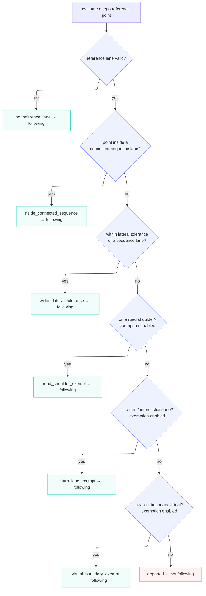

# The lane-following check

## What this does

`LaneFollowingChecker` answers one question each cycle: **is the ego still inside the lane it is
supposed to be following**? It takes the [reference lane](../README.md#key-words) the tracker is
holding, walks the lanes connected to it along the route, and tests the [ego reference
point](#key-words) against that set. The answer is a
verdict (`is_following`) plus the rule that produced it (`reason`).

The node uses the verdict as the default label. When no classifier claims an event, a passing check
gives `LANE_FOLLOWING`; a failing check, the ego left its lane with no classifier to explain it,
gives `UNKNOWN`. The check does not decide lane-change or crossing events; those are the classifiers'
job.

## Key words

Reference lane is shared across the package (defined in the [README](../README.md#key-words)). The
terms below are specific to the lane-following check.

| Term                | Meaning                                                                                                                          |
| ------------------- | -------------------------------------------------------------------------------------------------------------------------------- |
| Connected sequence  | The reference lane plus every lane reachable from it fore and aft along the routing graph, out to `connected_sequence_length_m`. |
| Ego reference point | The `base_link` position (a single point), not the vehicle footprint. The check tests this point.                                |
| Exemption           | A rule that reports following even though the ego point is outside the connected sequence and its tolerance band.                |
| Virtual boundary    | A lane boundary linestring tagged `virtual`, a boundary with no physical road marking.                                           |

## How the check decides

The rules run in a fixed order and the first match wins. Each rule is named after the
`LaneFollowingReason` value it returns.

### No reference lane

If the map is missing, the reference lane id is `InvalId`, or that id is not in the map, there is
nothing to check against. The check reports following. This is the tracker's warm-up state, not a
departure.

### Inside the connected sequence

The [connected sequence](#key-words) is built once per (reference lane, routing graph) and memoized. If the ego
point lies inside any lane in that sequence, the ego is following. This is the common case on a
straight or gently curving route.

### Within lateral tolerance

Lane polygons meet at shared boundaries, and the ego point can sit just outside every polygon while
still driving normally (localization noise, a point exactly on a boundary). If the point is within
`lateral_tolerance_m` of any sequence lane, the ego is still following.

### Road-shoulder exemption

Road shoulders are excluded from the routing graph, so they never appear in the connected sequence.
The ego straddling or entering a shoulder is expected (pull-over, obstacle avoidance), not a
departure. If the ego point overlaps a lane tagged as a road shoulder, the check reports following.
Controlled by `enable_road_shoulder_exemption`.

### Turn / intersection-lane exemption

Inside an intersection the ego cuts corners and leaves the lane polygon by design. If the reference
lane is an intersection lanelet, or the ego point sits inside an intersection lanelet within the
sequence, the check reports following. Controlled by `enable_turn_lane_exemption`.

### Virtual-boundary exemption

Where a lane's edge is a [virtual boundary](#key-words) rather than a painted line, crossing it is not a real lane
departure. The check finds the nearest sequence boundary to the ego point; if that boundary is a
virtual linestring, it reports following. Controlled by `enable_virtual_boundary_exemption`.

### Otherwise, Departed

No rule matched: the ego point is outside the connected sequence, past the lateral tolerance, and no
exemption applies. The check reports `departed` (not following). With no classifier claiming an
event, the node publishes `UNKNOWN`.

## Parameters

Schema: [`schema/lane_event_classifier.schema.yaml`](../schema/lane_event_classifier.schema.yaml).
Defaults: [`param/lane_event_classifier.param.yaml`](../param/lane_event_classifier.param.yaml).

| Name                                | Default | Meaning                                                                           |
| ----------------------------------- | ------- | --------------------------------------------------------------------------------- |
| `connected_sequence_length_m`       | 200.0   | Fore/aft distance walked from the reference lane to build the connected sequence. |
| `lateral_tolerance_m`               | 0.3     | Lateral margin around the connected sequence still treated as following.          |
| `enable_road_shoulder_exemption`    | true    | Treat the ego overlapping a road shoulder as following.                           |
| `enable_turn_lane_exemption`        | true    | Treat leaving the lane inside a turn / intersection lane as following.            |
| `enable_virtual_boundary_exemption` | true    | Treat crossing a virtual boundary as following.                                   |

Each exemption flag, when false, drops its rule from the chain: the check falls through to the next
rule and, if nothing else matches, reports `departed`.

## Design notes

- **Stateless verdict.** The map, reference lane, and ego point answer "am I in my lane?" on their
  own, so the check keeps no history: same inputs, same verdict. Remembering an onset to recognise a
  lane change or abort is the classifiers' job; the check stays out of it.
- **Cached sequence.** The connected sequence is a speed cache, rebuilt when the reference lane or
  routing graph changes; it never affects the verdict. Its key holds the routing-graph `shared_ptr`,
  not a raw pointer, so a reused address cannot cause a false hit. The builder
  `get_straight_lane_sequence_ids` is shared with `LaneTracker`, which keeps its own cache for a
  different reach length.
- **Point, not footprint.** The check tests the `base_link` point; a footprint test would flag corners
  clipping a neighbor lane on a curve, which is not a departure.
- **Reason is for tracing.** `to_string(LaneFollowingReason)` names the deciding rule in the log, so a
  departure can be told apart from an exemption afterwards.
